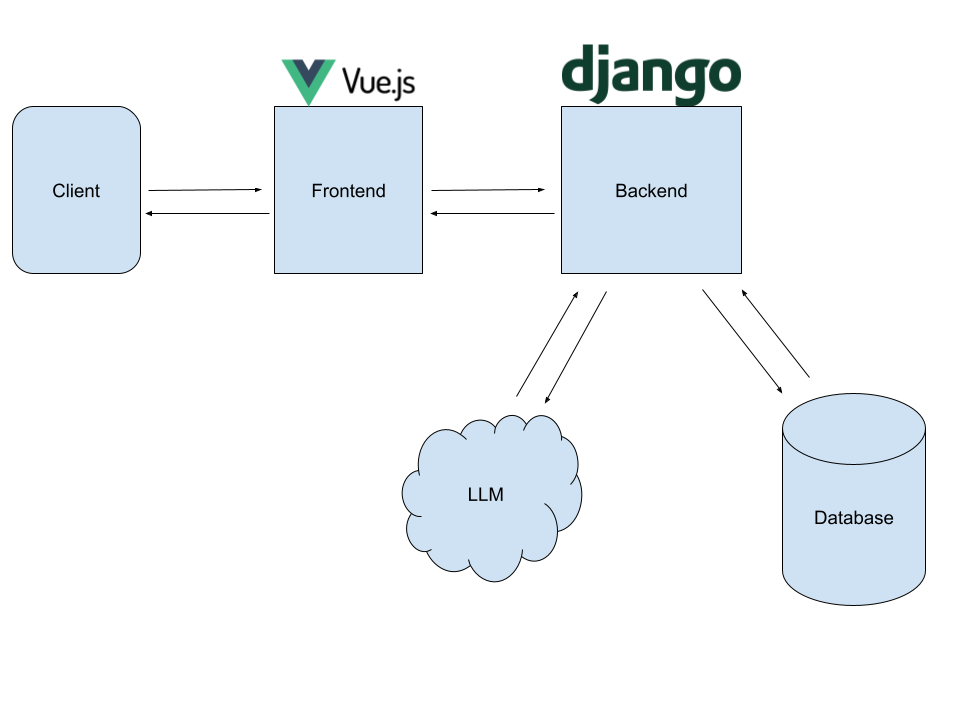

# About

SurfBuddy is a full-stack web application which recommends surfboards based on skill level, height, and weight. It utilizes a RESTful API and an external LLM to provide personalized suggestions. But Instead of relying on a web-based search, SurfBuddy leverages a dedicated database for surfboard information. As a Learning Project, this serves as a platform for exploring AI-based recommendation systems.

# Overview



# General Idea of the Communication Flow:

## Phase 1: LLM Only

1. Frontend requests to Django.
2. Django passes data to the LLM.
3. LLM generates recommendations and sends them back to Django.
4. Django formats the response and sends it to the frontend for display.

5. Validate if the LLM can provide reasonable recommendations in the first place before moving on to phase two.

## Phase 2: Database Integration

Enhance the LLM-driven recommendations with detailed information retrieved from a database, providing a richer and more informative user experience e.g. surfboard pictures, price tags etc.

# Project Setup

Quick run through of how to setup the project for local development

## Frontend

1. Ensure Node.js and npm are installed

- Check Node.js version: `node -v`
- Check npm version: `npm -v`
- If not installed, download and install Node.js from https://nodejs.org/

2. Create a virtual environment for the frontend by using "venv" or "conda"

```
conda create -n frontend
conda activate frontend
```

3. Navigate to the frontend directory and install dependecies

```
cd frontend
npm install
```

4. Run the development server

```
npm run dev
```

## Backend

1. Create a virtual environment for the frontend by using "venv" or "conda"

```
conda create -n backend
conda activate backend
```

2. Navigate to the backend directory and install dependecies

```
cd backend
pip install - requirements.txt
```

3. Start the Server

```
python manage.py runserver
```
